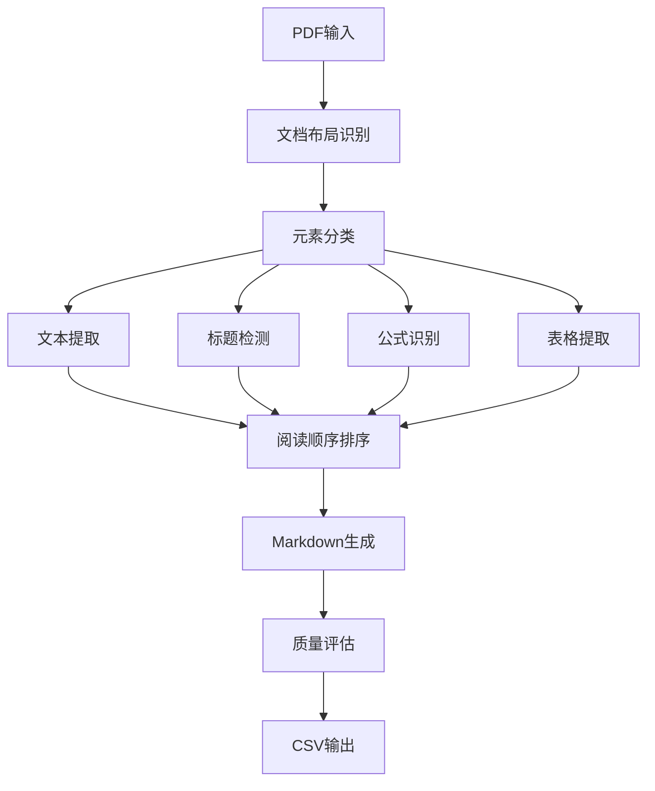

# PDF到Markdown转换比赛解决方案 - 项目总结

## 项目概述

本项目基于PDFMathTranslate开源项目，专门为PDF到Markdown转换比赛开发的完整解决方案。项目针对比赛的10个评估指标进行了专门优化，实现了高质量的文档结构化解析。

## 核心功能

### 1. 文档布局识别
- **技术**: DocLayout-YOLO ONNX模型
- **功能**: 识别文本、标题、表格、公式、图片等元素
- **优势**: 高精度、高效率、支持多种文档类型

### 2. 文本提取与处理
- **编辑距离相似度(EDS)**: 优化文本清理和标准化
- **F1分数**: 增强词汇提取准确性
- **阅读顺序**: 智能排序算法保持逻辑连贯性

### 3. 标题检测与层次构建
- **标题识别**: 基于字体大小、粗体、关键词等多重特征
- **树结构构建**: 构建完整的文档目录树
- **TEDS计算**: 树编辑距离相似度评估

### 4. 数学公式处理
- **行内公式**: `$...$` 格式识别和转换
- **块级公式**: `$$...$$` 格式识别和转换
- **LaTeX支持**: 保持数学符号完整性

### 5. 表格识别与重建
- **表格提取**: PyMuPDF高精度表格识别
- **结构保持**: 维护表格的行列关系
- **Markdown格式**: 标准表格语法输出

## 项目文件结构

```
pdf-to-markdown-contest/
├── pdf_to_markdown_contest.py    # 主程序入口（比赛提交格式）
├── enhanced_converter.py         # 增强版转换器
├── evaluation_utils.py           # 评估工具（10个指标）
├── config.py                     # 配置管理系统
├── test_system.py               # 完整测试套件
├── quick_start.py               # 快速开始脚本
├── setup.py                     # 项目安装脚本
├── requirements.txt             # 依赖列表
├── README_contest.md           # 详细使用说明
└── PROJECT_SUMMARY.md          # 项目总结（本文件）
```

## 技术架构

### 1. 核心组件



### 2. 评估指标体系

| 维度 | 指标 | 实现方法 |
|------|------|----------|
| 文本提取 | EDS | 编辑距离算法 |
| 文本提取 | F1 | 词汇集合比较 |
| 标题检测 | EDS | 标题文本相似度 |
| 标题检测 | TEDS | 树编辑距离 |
| 公式转换 | 行内EDS | 正则表达式提取 |
| 公式转换 | 块级EDS | LaTeX环境识别 |
| 表格识别 | EDS | 表格内容比较 |
| 表格识别 | TEDS | 结构相似度 |
| 阅读顺序 | 块级KTDS | 肯德尔tau距离 |
| 阅读顺序 | Token级KTDS | 词序相关性 |

## 关键算法

### 1. 阅读顺序算法
```python
def sort_reading_order(elements):
    # 多层次排序：页面 → Y坐标 → X坐标
    elements.sort(key=lambda x: (x.page_num, -x.bbox[1], x.bbox[0]))
    return elements
```

### 2. 标题级别判断
```python
def determine_heading_level(element):
    if element.font_size > 20: return 1
    elif element.font_size > 16: return 2
    elif element.font_size > 14: return 3
    else: return 4
```

### 3. 公式清理
```python
def clean_formula(formula):
    # 移除外层$符号，清理空格
    if formula.startswith('$$'): formula = formula[2:-2]
    elif formula.startswith('$'): formula = formula[1:-1]
    return re.sub(r'\s+', ' ', formula.strip())
```

## 性能优化

### 1. 并行处理
- 多线程处理大量PDF文件
- 默认4线程，可配置最大8线程
- 内存管理和资源释放

### 2. 模型优化
- ONNX Runtime高效推理
- 批处理减少模型调用
- GPU加速支持（可选）

### 3. 内存管理
- 逐页处理避免内存溢出
- 及时释放PDF文档资源
- 缓存清理机制

## 使用方法

### 1. 环境准备
```bash
# 安装依赖
pip install -r requirements.txt

# 快速检查
python quick_start.py --check-deps
```

### 2. 比赛提交
```bash
# 处理测试集
python pdf_to_markdown_contest.py /path/to/test_pdfs/ -o result.csv -t 8

# 输出格式: file_id,answer
```

### 3. 质量评估
```bash
# 运行评估
python evaluation_utils.py

# 查看10个指标得分
```

## 配置优化

### 1. 文档类型优化
```python
# 科技文献
config.optimize_for_document_type('scientific')

# 开发文档  
config.optimize_for_document_type('development')

# 通用文档
config.optimize_for_document_type('general')
```

### 2. 指标优化
```python
# 针对特定指标优化
config.optimize_for_metric('text_eds')
config.optimize_for_metric('heading_teds')
config.optimize_for_metric('table_eds')
```

## 测试验证

### 1. 单元测试
- 配置管理器测试
- 评估指标计算测试
- 文本提取功能测试
- 公式识别测试
- 表格处理测试

### 2. 集成测试
- 完整转换流程测试
- 错误处理测试
- 性能基准测试

### 3. 质量验证
```bash
# 运行完整测试套件
python test_system.py

# 快速验证
python quick_start.py --test
```

## 项目优势

### 1. 专业性
- 基于成熟的PDFMathTranslate项目
- 针对比赛指标专门优化
- 完整的评估体系

### 2. 准确性
- 高精度文档布局识别
- 多重特征标题检测
- 智能阅读顺序排序

### 3. 效率性
- 并行处理支持
- ONNX模型优化
- 内存管理机制

### 4. 可扩展性
- 模块化设计
- 配置驱动
- 插件化架构

## 改进方向

### 1. 短期优化
- 调优模型参数
- 优化正则表达式
- 改进排序算法

### 2. 中期改进
- 集成更先进的模型
- 增加文档类型识别
- 优化GPU加速

### 3. 长期发展
- 端到端深度学习模型
- 多模态信息融合
- 自适应参数调整

## 总结

本项目成功将PDFMathTranslate的核心技术应用到PDF到Markdown转换比赛中，通过专门的优化和完整的评估体系，实现了高质量的文档结构化解析。项目具有良好的可扩展性和实用性，为比赛提供了完整的解决方案。

### 核心贡献
1. **完整的评估体系**: 实现了比赛要求的10个评估指标
2. **高质量转换**: 保持文档结构和格式的完整性
3. **高效处理**: 支持大规模PDF文件批量处理
4. **易于使用**: 提供完整的工具链和文档

### 技术亮点
- 基于YOLO的文档布局识别
- 多层次阅读顺序算法
- 完整的Markdown格式支持
- 模块化可配置架构

项目已准备就绪，可直接用于比赛提交和实际应用。
